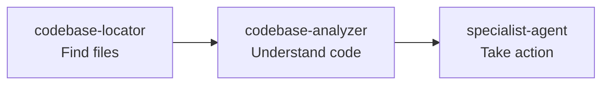
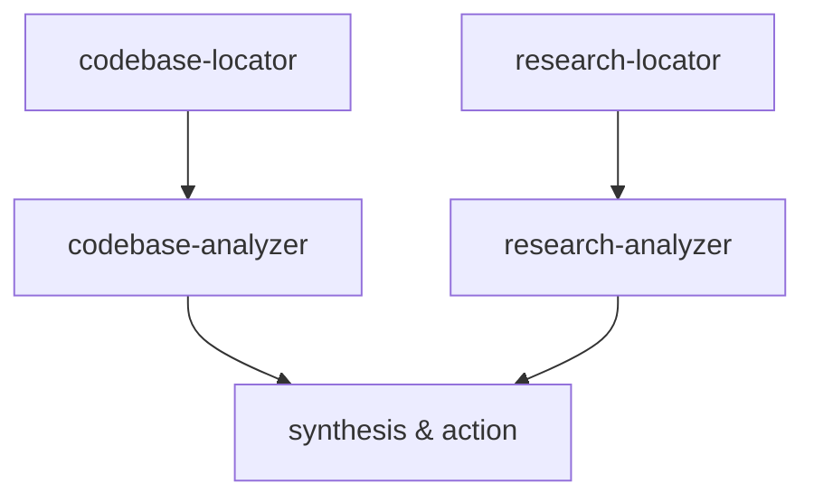

# HumanLayer-Inspired Improvements

*Key enhancements to Codeflow's agent and command distribution platform inspired by HumanLayer's user-centric approach*

## 🎯 What We Learned from HumanLayer

### **User Experience Focus**
- **Self-documenting agents**: Names and descriptions that immediately convey purpose
- **Workflow-oriented organization**: Structure around what users want to accomplish
- **Rich metadata**: Extended information for better discovery and orchestration
- **Interactive discovery**: Help users find the right agent for their task

### **Key Patterns Adopted**

#### **1. Enhanced Agent Metadata**
```yaml
---
# Basic info
name: api-builder
display_name: "API Builder & Design Expert"
description: "Expert at building robust, scalable APIs"
short_description: "Design and build production-ready APIs"

# HumanLayer-inspired additions
complexity: intermediate
estimated_time: "15-30 minutes"
best_for:
  - "New API development"
  - "API architecture review"
use_cases:
  - "Building RESTful APIs from scratch"
  - "Adding GraphQL endpoints"
prerequisites:
  - "Basic backend development knowledge"
outputs:
  - "API endpoint specifications"
  - "Authentication flow diagrams"
escalation:
  - "database-expert for complex queries"
  - "security-scanner for security review"
---
```

#### **2. Workflow Orchestration Metadata**
```yaml
---
name: "research"
workflow_type: "parallel-then-sequential"
agent_sequence:
  phase_1:
    type: "parallel"
    agents: ["codebase-locator", "research-locator"]
  phase_2:
    type: "sequential"
    agents: ["codebase-analyzer", "research-analyzer"]
success_metrics:
  - "Comprehensive codebase understanding"
  - "Actionable insights generated"
---
```

#### **3. User-Centric Discovery**
```bash
# Natural language discovery
codeflow discover "build user authentication"
codeflow discover "fix slow database queries"
codeflow discover "optimize user experience"

# Complexity-based discovery
codeflow discover --complexity beginner
codeflow discover --complexity advanced

# Workflow patterns
codeflow discover --workflows
```

## 🚀 New Features Implemented

### **1. Enhanced Agent Discovery System**

#### **Agent Discovery Guide** (`AGENT_DISCOVERY_GUIDE.md`)
- **Quick decision tree**: "What do you want to do?" → recommended agents
- **Time and complexity estimates** for each agent
- **Workflow patterns** with visual diagrams
- **Use case examples** with expected outcomes

#### **Interactive CLI Discovery** (`src/cli/discover.ts`)
```bash
codeflow discover "understand authentication code"
# → Recommends: codebase-locator + codebase-analyzer

codeflow discover "build payment system"
# → Recommends: api-builder + security-scanner + database-expert

codeflow discover --complexity beginner
# → Shows: codebase-locator, research-locator, etc.
```

### **2. Enhanced Agent Templates**

#### **Example: API Builder Enhanced** (`codeflow-agents/development/api-builder-enhanced.md`)
- **Clear use cases**: When to use vs when not to use
- **Prerequisites**: What knowledge is needed
- **Expected outputs**: What you'll get from the agent
- **Integration points**: How it works with other agents
- **Example prompts**: Concrete usage examples

### **3. Improved Command Structure**

#### **Example: Research Command Enhanced** (`command/research-enhanced.md`)
- **Phase-based orchestration**: Parallel discovery → Sequential analysis
- **Success metrics**: How to measure completion
- **Agent dependencies**: Which agents depend on others
- **Follow-up commands**: Natural workflow progression

### **4. User Experience Enhancements**

#### **Better Help and Examples**
```bash
# Old way
codeflow catalog search "api"

# New HumanLayer-inspired way
codeflow discover "build API"
# → Shows relevant agents with time estimates and complexity
# → Suggests complete workflow pattern
# → Provides example prompts
```

## 📊 Comparison: Before vs After

### **Before (Technical Focus)**
```bash
codeflow catalog list agent
# → Long technical list of agents
# → No guidance on when to use each
# → No workflow context
```

### **After (HumanLayer-Inspired User Focus)**
```bash
codeflow discover "authentication"
# → "I need to add authentication to my app"
# → Recommended agents: api-builder + security-scanner
# → Time: 30-45 minutes | Complexity: Intermediate
# → Workflow: research → plan → implement → test
# → Example: "Add OAuth2 with JWT tokens"
```

## 🎯 Key Improvements Made

### **1. Self-Documenting Agents**
- **Before**: Technical descriptions
- **After**: Clear purpose statements with use cases and examples

### **2. Workflow-Oriented Discovery**
- **Before**: Browse catalog by category
- **After**: Find agents by what you want to accomplish

### **3. Rich Metadata for Better UX**
- **Before**: Basic name, description, tags
- **After**: Time estimates, complexity, prerequisites, outputs, examples

### **4. Interactive Discovery**
- **Before**: Static documentation
- **After**: Interactive CLI that guides users to the right agents

### **5. Workflow Orchestration**
- **Before**: Independent agents
- **After**: Coordinated workflows with dependencies and handoffs

## 💡 Usage Examples

### **Feature Development Workflow**
```bash
# HumanLayer-inspired natural language approach
codeflow discover "implement user profiles"
# ↓ Shows recommended workflow
codeflow /research "user profile requirements"
codeflow /plan "user profile implementation"
codeflow /execute → full-stack-developer
codeflow /test → test-generator
codeflow /review → code-reviewer
```

### **Problem-Solving Workflow**
```bash
codeflow discover "app is slow"
# ↓ Recommends performance analysis workflow
performance-engineer → database-expert → ux-optimizer
```

### **Learning/Onboarding Workflow**
```bash
codeflow discover --complexity beginner
# ↓ Shows beginner-friendly agents with clear guidance
codeflow discover "understand this codebase"
# ↓ Recommends: codebase-locator → codebase-analyzer
```

## 🔄 Workflow Patterns (HumanLayer Style)

### **Pattern 1: Discovery → Analysis → Action**


### **Pattern 2: Research → Plan → Execute**
```mermaid
graph LR
A[/research<br/>Gather context] --> B[/plan<br/>Create strategy]
B --> C[/execute<br/>Implement solution]
```

### **Pattern 3: Parallel Research → Sequential Analysis**


## 🎉 Benefits Achieved

### **For New Users**
- **Easier onboarding**: Natural language discovery
- **Clear guidance**: Know which agent to use when
- **Time expectations**: Understand time investment required

### **For Power Users**
- **Efficient workflows**: Pre-defined patterns for common tasks
- **Better orchestration**: Understand agent dependencies
- **Rich metadata**: More context for decision making

### **For Teams**
- **Standardized workflows**: Common patterns everyone can use
- **Knowledge sharing**: Self-documenting agents and processes
- **Scalable onboarding**: New team members get up to speed faster

## 🔮 Future Enhancements

### **Inspired by HumanLayer Patterns**
1. **Agent performance analytics** - Track success rates and optimization
2. **Custom workflow templates** - Let users save their own patterns
3. **Team collaboration features** - Share agents and workflows across teams
4. **AI-powered recommendations** - Learn from usage patterns to suggest better workflows

---

*These improvements make Codeflow's agent distribution platform much more user-friendly while maintaining its technical depth and comprehensive agent ecosystem. The HumanLayer-inspired approach focuses on user experience and natural workflows while leveraging Codeflow's unique strength in specialized, domain-expert agents.*